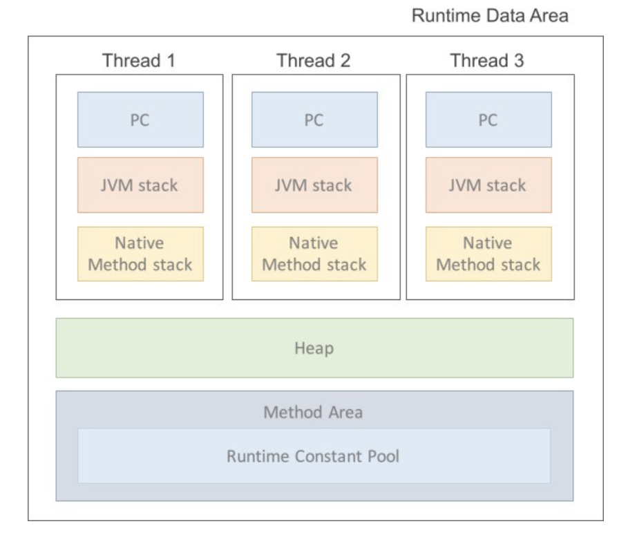

# JAVA

##### JVM

- 자바가상머신(Java virtual machine)
- 자바 어플리케이션을 클래스 로더를 통해 읽어 들여 자바 API와 함께 실행하는 것
- OS에 구애받지 않고 재사용을 가능하게 해줌
- 메모리 관리, GC를 수행. 
- 스택기반의 가상머신임
- ARM은 참고로 레지스터 기반!
- 실행과정
  - 프로그램이 실행되면 JVM이 OS로부터 메모리 할당받음
  - JVM은 이 메모리를 나누어 관리
  - 자바 컴파일러(Javac)가 자바 소스코드(.java)를 읽어들여 자바 바이트코드(.class) 로 변환
  - class loader가 class파일들을 jvm으로 다시 로딩
  - 로딩된 파일들은 실행 엔진을 통해 해석
  - 해석된 바이트코드는 runtime data areas 에 배치되어 실질적인 수행이 이루어짐
  - 이 과정 속에서 JVM이 스레드 동기화와 GC 같은 관리작업 실행
- 구성
  - Class Loader(클래스 로더)
    - JVM 내로 클래스를 로드하고, 링크를 통해 배치하는 작업을 수행하는 모듈
    - 런타임 시에 동적으로 클래스를 로드
    - .jar 파일 내 저장된 클래스들을 JVM위에 탑재하고, 사용하지 않는 클래스들은 메모리에서 삭제!
  - Execution Engine (실행 엔진)
    - 클래스를 실행함
    - 로더가 jvm 런타임 데이터 영역에 있는 바이트 코드를 배치시키고, 이를 실행
  - Interpreter(인터프리터)
    - 실행 엔진은 자바 바이트 코드를 명령어 단위로 실행 - 한줄 씩 실행해서 느림
  - JIT(Just-In-Time)
    - 인터프리터 방식의 단점을 보완하기 위해 도입된 컴파일러
    - 한줄씩 실행하다가 적절한 시점에 바이트코드 전체를 컴파일하여 네이티브 코드로 변경하고, 이를 캐시에 저장해서 빠르게 수행됨
  - GC
    - GC를 수행하는 모듈이 있음
- Runtime Data Area
  - 프로그램을 수행하기 위해 OS에서 할당받은 메모리 공간
    - 
    - PC Register
      - 스레드가 시작될 때 생성되며 생성될 때마다 생성되는 공간으로 스레드마다 하나씩 존재
      - 스레드가 어떤 부분을 어떤 명령으로 실행해야할 지에 대한 기록. 프로그램 카운터!!
    - JVM 스택
      - 임시로 할당되었다가 메소드를 빠져나가면 바로 소멸되는 특성의 데이터를 저장
      - 각종 형태의 변수, 데이터, 스레드나 메소드의 정보 저장
    - Native Method Stack
      - 실제 실행할 수 있는 기계어로 작성된 프로그램을 실행시키는 영역
      - JAVA가 아닌 다른 언어로 작성된 코드를 위한 공간
    - .Method Area (=Class area = Static area)
      - 클래스 정보를 처음 메모리 공간에 올릴 때 초기화되는 대상을 저장하기 위한 메모리 공간
      - 올라가는 정보 
        - Field Information - 멤버 변수의 이름, 데이터 타입, 접근 제어자
        - Method Information - 메소드의 이름, 리턴 타입, 매개변수, 접근 제어자
        - Type Information - class인지 interface인지 저장 super 클래스의 전체 이름
    - HEAP (힙영역)
      - 객체를 저장하는 가상 메모리 공간
      - new로 생성된 객체와 배열을 저장
      - 물론 class area에 있는 클래스들만 객체로 생성 가능